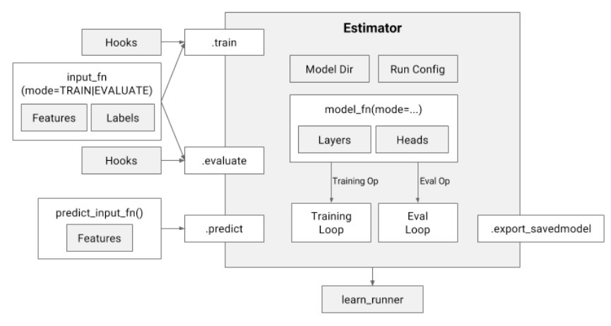

# NLP tf.estimator 项目模版

## 目录
- [依赖](#依赖)
- [参考](#参考链接)

tensorflow的Estimator高级API，将模型的train, eval, predict, save规范化，
免去了tensorflow的Session.run的操作，并且很好地结合了tf.data.Dataset作为数据处理的包装，
使得整个模型从数据到模型产出的整体思路抽象封装成接口，方便用户自定义设计model

## 依赖
- tensorflow-gpu 115
- numpy 1.16.0 解决warning
- cuda toolkit 10.0, cudnn 7.4
- gensim 3.8.3

## 主体架构

## 流程

1. 训练word2vec，然后使用vocabulary进行转化成模型可以使用的结构
2. 根据训练结果，修改config.json中的参数，主要是vocab size会根据语料的不同进行变化，word2vec训练参数也会影响vocab size
3. 训练模型train
4. infer

## 参考链接
- https://zhuanlan.zhihu.com/p/112062303